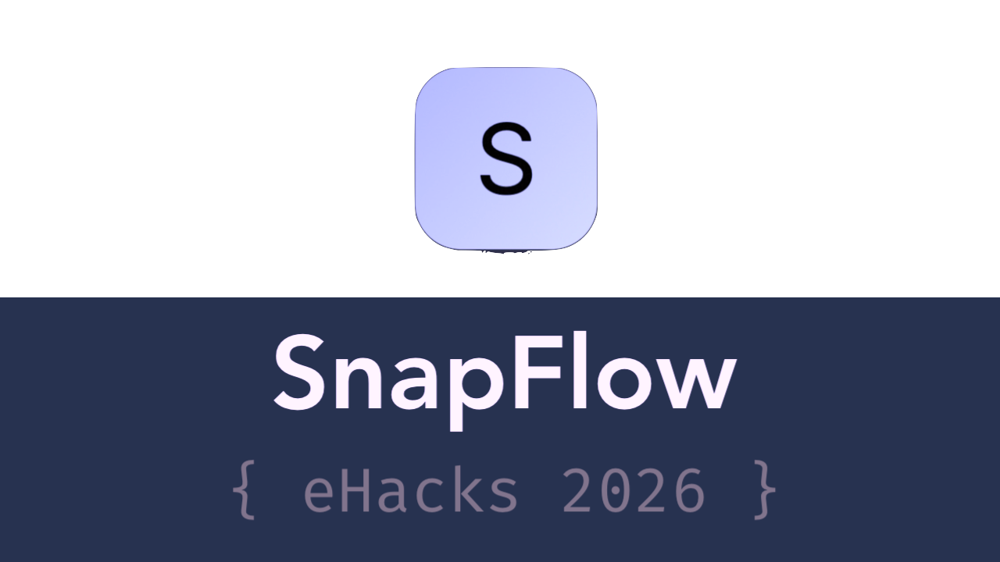

# SnapFlow

A lightweight macOS time-tracking sidebar that syncs with your calendar, visualizes your schedule in real-time, and keeps your current focus in view. A productivity HUD for people who want time to feel tangible.

> **Note:** This project was created as part of the [**SIUE Hackathon 2026**](https://ehacks.cs.siue.edu/) in St. Louis. Watch the trailer [here](https://youtu.be/h4mTnchsRWY).



---

## Features

- **Real-Time Schedule Visualization:** An always-on-top sidebar that displays your calendar events for the day on a vertical timeline, with customizable view.
- **iCal Synchronized:** Synchronize this at-a-glance view with your existing calendar events, with seamless cross-updates.
- **Interactive Time Shifting:**
    - **Open in Calendar:** Click on an event to open it in Apple Calendar.
    - **Resize or Move Events**: Super convenient resizing right from the expanded calendar view - just click and drag any event. Shifting events also works in multi-select mode.
- **Agentic Scheduling with Gemini:** Use natural language to describe your tasks for the day (e.g., "work on my thesis for 3 hours and go for a run"), and let AI generate and save a detailed schedule directly to your calendar. This can be done both with voice recognition or text input.
- **TODO Manager:** Hovering over upper part of ruler allows 
- **Customizable & Persistent Settings:** Configure your Gemini API key securely in the app's preferences. See the settings window for further customization options.

## Getting Started

### Prerequisites

- macOS
- Xcode

### Installation

1.  **Clone the repository:**
    ```sh
    git clone https://github.com/your-username/SnapFocus.git
    cd SnapFocus
    ```

2.  **Open the project in Xcode:**
    ```sh
    open SnapFocus.xcodeproj
    ```

3.  **Add Package Dependencies:**
    - In Xcode, go to `File > Add Package Dependencies...`.
    - Paste the following URL into the search bar: `https://github.com/google/generative-ai-swift`
    - Follow the prompts to add the package to the `SnapFocus` target.

4.  **Configure API Key:**
    - Open the app's preferences by pressing `Cmd+,` or going to `SnapFocus > Preferences...`.
    - Enter your Gemini API key and click "Save". You can get a key from [Google AI Studio](https://aistudio.google.com/).

5.  **Build and Run:**
    - Press `Cmd+R` to build and run the application.

## Usage

- **Ruler Overlay:** 
    - The main timeline view appears on the left side of your screen. Hover over it to expand and see event details.
    - Hover over a specific event to see its exact start/end time.
    - With the ruler open, use cmd +/- to expand or shrink the sizing of the ruler to adjust for a larger overview vs. focus on short events.
- **Move/Resize Events:**
    - To resize an event, drag its top or bottom edge.
    - To select one or multiple events for moving, you can use a normal click, or shift/cmd click to multi-select.
    - Once events are selected, simply click and drag one of them to move the group.
- **TODO Manager:** Hovering over upper part of ruler expands the TODO view, which allows users to edit and view TODO tasks for the currently active event. All TODOs are stored in the notes section of an event, so they can be edited both from within SnapFlow and iCal.
- **Agentic Scheduler:**
    - Open the scheduler window with `Cmd+Shift+S` or via `Show Agentic Scheduler` in the menu bar. From here, you can also toggle between voice and keyboard input. 

## License

This project is licensed under the MIT License - see the [LICENSE](LICENSE) file for details.
